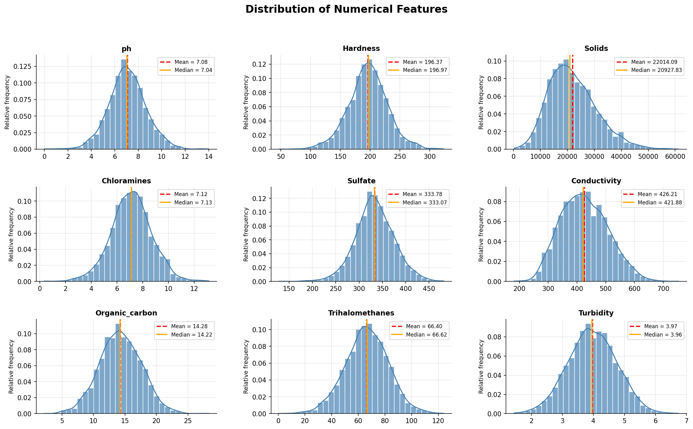

# EDA Findings: Water Potability Dataset

## Purpose

This document summarises the key observations from `notebooks/EDA.ipynb` and explains how they inform the preprocessing pipeline. The notebook is kept as an exploratory reference and is not pushed to the repository due to output size constraints from CI/CD actions.

---

## Key Observations

### Feature Distributions

All numerical features (excluding the `Potability` target) are continuous and approximately Gaussian. The table below shows quantified skewness per feature, sorted by magnitude:

| Feature         | Skewness |
| --------------- | -------: |
| Solids          |   0.6216 |
| Conductivity    |   0.2645 |
| ph              |   0.0256 |
| Organic_carbon  |   0.0255 |
| Turbidity       |  -0.0078 |
| Chloramines     |  -0.0121 |
| Sulfate         |  -0.0359 |
| Hardness        |  -0.0393 |
| Trihalomethanes |  -0.0830 |

All features fall well within acceptable skewness bounds (|skew| < 1), supporting the use of parametric preprocessing methods.

### Missing Values

Three features contain missing values, with `Sulfate` being the most affected:

| Feature         | Missing (%) |
| --------------- | ----------: |
| Sulfate         |        23.8 |
| ph              |        15.0 |
| Trihalomethanes |         4.9 |

The remaining six features have no missing values. Given the near-Gaussian distributions of all three affected features, **mean imputation** is appropriate. Means must be learned only from the active training subset: from each cross-validation fold's training rows during development, and from the full training split during the final refit.

### Class Balance

The target variable is moderately imbalanced:

| Potability      | Proportion (%) |
| --------------- | -------------: |
| 0 (Not potable) |           61.0 |
| 1 (Potable)     |           39.0 |

The ~22 percentage point gap is meaningful but not extreme. This imbalance should be accounted for downstream via stratified splitting and, depending on the model, class weighting or threshold tuning at evaluation time.

---

## Preprocessing Decisions

The near-Gaussian distributions directly motivated the following design choices:

| Decision                                      | Rationale                                                                              |
| --------------------------------------------- | -------------------------------------------------------------------------------------- |
| Outlier removal via z-score threshold (z > 3) | Valid under near-normality assumption                                                  |
| Mean imputation                               | Appropriate for symmetric, roughly Gaussian features; means learned from training only |
| Z-score (standard) scaling                    | Preserves Gaussian structure; required before RFE                                      |
| Stratified split and CV folds                 | Preserves the 61/39 class ratio across the final test split and development folds      |

### Pipeline Order

The pipeline is applied in the following sequence to prevent data leakage:

1. Stratified train / final-test split
2. Engineered feature construction (ratios, interactions, flags)
3. Stratified k-fold cross-validation on the training split only
4. Per fold: outlier removal — **fold-training rows only**
5. Per fold: mean imputation — statistics learned from cleaned fold-training rows
6. Per fold: Z-score scaling — statistics learned from imputed fold-training rows
7. Per fold: RFECV feature selection — **fold-training rows only**
8. Refit the same learned preprocessing stack on the full training split
9. Evaluate the final fitted model once on the untouched test split

> **Note:** Learned preprocessing is fit inside each cross-validation fold. The final test split is not used for outlier filtering, imputation, scaling, feature selection, or model selection.

---

## Candidate Engineered Features

Domain knowledge was used to construct features that may capture chemistry relationships not represented by the raw measurements alone.

### Ratios

Capture relative concentrations between related variables:

| Feature                       | Formula                          |
| ----------------------------- | -------------------------------- |
| `conductivity_solids_ratio`   | Conductivity / Solids            |
| `turbidity_solids_ratio`      | Turbidity / Solids               |
| `hardness_conductivity_ratio` | Hardness / Conductivity          |
| `hardness_solids_ratio`       | Hardness / Solids                |
| `sulfate_hardness_ratio`      | Sulfate / Hardness               |
| `tds_conductivity_ratio`      | Solids / Conductivity            |
| `trihalo_formation_risk`      | Organic_carbon / Trihalomethanes |

### Interactions

Capture non-linear joint effects between variables:

| Feature                         | Formula                          |
| ------------------------------- | -------------------------------- |
| `chloramines_ph_interaction`    | Chloramines × ph                 |
| `ph_hardness_interaction`       | ph × Hardness                    |
| `organic_trihalo_interaction`   | Organic_carbon × Trihalomethanes |
| `turbidity_organic_interaction` | Turbidity × Organic_carbon       |

### Additive Composites

Aggregate load or stress across related variables:

| Feature                | Formula                                 |
| ---------------------- | --------------------------------------- |
| `disinfection_stress`  | Sulfate + Chloramines                   |
| `dbp_precursor_load`   | Organic_carbon + (Trihalomethanes / 10) |
| `total_oxidant_stress` | Chloramines + (Sulfate / 10)            |
| `solids_sulfate_diff`  | Solids − Sulfate                        |

### Risk Indicators

Threshold-based flags and scores aligned with water quality guidelines:

| Feature                  | Definition                                                                                                  |
| ------------------------ | ----------------------------------------------------------------------------------------------------------- |
| `turbidity_trihalo_risk` | 1 if Turbidity > 5 NTU **and** Trihalomethanes > 80                                                         |
| `risk_score`             | Additive count of: pH outside 6.5–8.5, Turbidity > 5, Trihalomethanes > 80, Chloramines > 10, Sulfate > 400 |
| `expanded_risk_score`    | `risk_score` + flags for Sulfate > 250, Hardness > 200, Conductivity > 400                                  |
| `ph_safe_range`          | 1 if pH ∈ [6.5, 8.5]                                                                                        |
| `high_turbidity`         | 1 if Turbidity > 5 NTU                                                                                      |
| `high_sulfate`           | 1 if Sulfate > 250 mg/L                                                                                     |
| `high_chloramines`       | 1 if Chloramines > 4 mg/L                                                                                   |
| `high_hardness`          | 1 if Hardness > 200 mg/L                                                                                    |

> **Note:** `risk_score` and `expanded_risk_score` intentionally use stricter thresholds for some variables than the individual WHO binary flags (e.g. Chloramines > 10 vs > 4). The composite scores are designed to flag only the most severe combined violations, whereas the individual flags capture any exceedance of the WHO guideline values.
