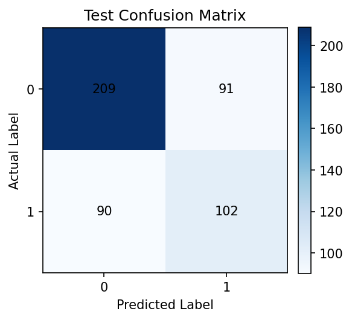
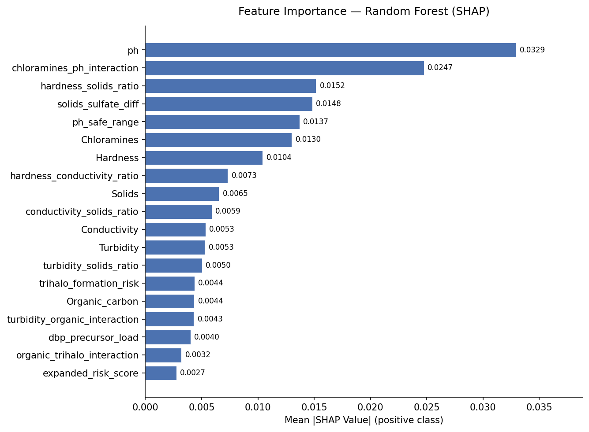

# MLOps Project Report — Water Potability Classification

---

## 1. Motivation and Success Metrics

Access to clean drinking water is one of the most fundamental public health challenges worldwide. According to the WHO, approximately 2 billion people lack access to safe water at home, making automated water quality assessment a practically meaningful problem. We chose the Kaggle Water Potability dataset because it represents a realistic scenario where automated screening could supplement traditional laboratory testing, particularly in resource-constrained settings where testing every sample manually is not feasible.

The dataset contains 3,276 water samples, each described by nine physicochemical measurements: pH, hardness, total dissolved solids, chloramines, sulfate, conductivity, organic carbon, trihalomethanes, and turbidity. The binary target indicates whether a sample is safe to drink (1) or not (0).

### Success Metrics

We defined success along two dimensions before any modelling began:

- **Primary metric (ROC-AUC ≥ 0.65 on the test split):** ROC-AUC is threshold-independent and handles class imbalance better than accuracy, making it the right choice for comparing models across the development phase.
- **Secondary metric (test F1 ≥ 0.45 for the positive class):** In a water safety context, failing to flag unsafe water (false negatives) is more costly than wrongly flagging safe water, so recall matters alongside precision.

We considered our pipeline successful if the best model cleared both thresholds on the untouched test split.

---

## 2. Project Planning

We organised the work into four iterative sprints loosely inspired by the agile methodology. Each sprint had a clear deliverable and a definition of done.

### Sprint 1 — Exploratory Analysis and Data Contract (Week 1)

We started by exploring the dataset in `notebooks/EDA.ipynb` to understand feature distributions, missingness, and class balance before writing a single line of pipeline code. The main findings (near-Gaussian distributions, three nullable features, and a 61/39 class split) directly shaped every preprocessing decision made in Sprint 2. We also defined a Great Expectations raw data contract as the formal definition of what constitutes acceptable input, encoding the agreed missingness limits and physically plausible ranges for each measurement.

**Deliverable:** EDA notebook, `docs/eda_findings.md`, and a fail-fast Great Expectations validation node in the Kedro pipeline.

### Sprint 2 — Preprocessing Pipeline (Week 2)

With the data contract in place, we built the full Kedro preprocessing pipeline: stratified 70/15/15 splitting, deterministic feature engineering (23 derived features from domain knowledge), training-only outlier removal, fold-local mean imputation and standard scaling, and RFECV-based feature selection. The key architectural decision was to move all learned preprocessing inside each CV fold rather than fitting it once on the full training set, which eliminates any leakage of validation statistics into the feature transformation.

**Deliverable:** `src/mlops_project/pipelines/preprocessing/`, 36 unit tests, and persisted `X_train.pkl`, `X_test.pkl`, `y_train.pkl`, `y_test.pkl`.

### Sprint 3 — Modelling, Tuning, and MLflow (Weeks 3–4)

We trained five model families in order of complexity: a logistic regression baseline followed by four tree-based classifiers (Random Forest, Extra Trees, Histogram Gradient Boosting, XGBoost). For each tree model, we ran an Optuna hyperparameter search on training-set-only stratified CV before fitting the final model on the full training set and evaluating it once on the test split. All experiments were tracked in MLflow, with per-run artifacts including CV fold metrics, Optuna trial logs, the best hyperparameters, and the serialised model bundle.

**Deliverable:** `src/mlops_project/pipelines/modeling/`, MLflow experiment `water_potability_modeling`, `data/08_reporting/model_comparison.csv`.

### Sprint 4 — Explainability, Drift Detection, and Serving (Week 5)

In the final sprint we added the three production-readiness components. SHAP explainability was added for the best-performing model to understand which features drive predictions. A data drift detection pipeline using KS tests was built to monitor whether the feature distributions seen in deployment diverge from the training baseline. Finally, we containerised the Random Forest model bundle as a FastAPI REST API so the classifier can be queried without any Python environment setup.

**Deliverable:** SHAP summary plot, `data/08_reporting/drift_report.csv` and `simulated_drift_report.csv`, `Dockerfile`, `docker-compose.yml`, and this report.

---

## 3. Data Exploration and Modelling Results

### 3.1 Exploratory Analysis

The EDA revealed three important characteristics of the dataset, visible in the feature distributions below:

**Near-Gaussian feature distributions.** All nine measurements have skewness below 0.7 in absolute value, which justifies parametric preprocessing: Z-score outlier removal, mean imputation, and standard scaling all assume roughly symmetric distributions.

**Selective missingness.** Only pH (15.0 %), sulfate (23.8 %), and trihalomethanes (4.9 %) have missing values. All three are nullable by domain convention — instruments occasionally produce out-of-range readings that are recorded as absent rather than zero. Mean imputation fitted per training fold handles these gaps without leaking evaluation-split statistics into the transform.

**Moderate class imbalance.** 39 % of samples are potable, 61 % are not. Stratified splitting and CV folds preserve this ratio across every subset, and ROC-AUC is the primary development metric precisely because it is threshold-invariant.

### 3.2 Feature Engineering

We constructed 23 additional features from domain knowledge: ratio features (e.g., `conductivity_solids_ratio`), interaction terms (e.g., `chloramines_ph_interaction`), additive composites (e.g., `disinfection_stress = Sulfate + Chloramines`), and binary risk flags based on WHO guidelines. RFECV then selected the subset of these 32 features that improved cross-validated ROC-AUC.

### 3.3 Model Comparison

All models were evaluated with 5-fold stratified cross-validation on the training set and a single held-out test evaluation. The table below reports the primary development metric (CV F1) alongside the test ROC-AUC, which is the success criterion defined in Section 1.

| Rank | Model | CV F1 ± std | Test ROC-AUC | Test F1 |
|------|-------|-------------|--------------|---------|
| 1 | **Random Forest** | **0.476 ± 0.050** | **0.678** | **0.514** |
| 2 | Hist. Gradient Boosting | 0.397 ± 0.067 | 0.658 | 0.511 |
| 3 | XGBoost | 0.373 ± 0.076 | 0.677 | 0.525 |
| 4 | Extra Trees | 0.166 ± 0.117 | 0.664 | 0.175 |
| 5 | Logistic Regression | 0.132 ± 0.076 | 0.551 | 0.136 |

Random Forest achieves the highest CV F1 (0.476) and the highest test ROC-AUC (0.678), clearing both success thresholds from Section 1. The logistic regression baseline, while stable (low CV std), is far behind the tree models, confirming the relationship between water quality and potability is not well captured by a linear boundary. Extra Trees shows high variance across folds (std 0.117) despite a reasonable test AUC, suggesting it generalised less reliably than the other ensembles.

The confusion matrix on the test split shows the model is better at identifying non-potable samples (the majority class) than potable ones, which is expected given the class imbalance and the modest recall (0.49) for the positive class.

### 3.4 SHAP Feature Importance (Random Forest)

SHAP (SHapley Additive exPlanations) attributes each feature's contribution to individual predictions on a theoretically grounded basis. We used TreeExplainer, which computes exact SHAP values for tree models without approximation.

pH dominates, consistent with domain knowledge: it is the single most commonly monitored indicator of water safety, and extreme values (below 6.5 or above 8.5) are an immediate disqualifying factor. The second-ranked feature, `chloramines_ph_interaction`, shows that the combined effect of chloramine concentration and acidity matters more than either alone — both are disinfection-related and interact chemically. Several of the top-ten features are engineered (ranks 2–5, 8, 10), which confirms that the feature engineering step in Section 3.2 added genuine predictive value beyond the nine raw measurements.

---

## 4. Production Implementation Discussion

### 4.1 Technology Choices and Their Advantages

**Kedro** structures the project as a directed acyclic graph of named nodes, with every intermediate dataset catalogued in a single YAML file. This makes it trivial to rerun any subset of the pipeline in isolation (`kedro run --pipeline=data_drift`) and ensures every experiment starts from a reproducible state, instead of a series of scripts with implicit, hard-to-audit dependencies.

**MLflow** provides experiment tracking that goes beyond saving the best model: every CV run, Optuna trial, and holdout evaluation is logged with its exact hyperparameters, metrics, and artifacts, creating a full audit trail we could use to roll back to an earlier model.

**Optuna** with the TPE sampler explores the hyperparameter space more efficiently than grid search by building a probabilistic model of which regions tend to produce better results. For the Random Forest we ran 75 trials, improving CV F1 over the default, untuned parameters.

**FastAPI + Docker** separate the prediction API from the training infrastructure: a consumer sends nine water quality measurements as JSON and gets back a prediction and probability, with no Python or Kedro installation required on their end.

### 4.2 Risks and Mitigations

**Data scale.** The pipeline uses Pandas, which loads the entire dataset into memory on a single machine. That is not a problem for this 3,276-row dataset, but if applied to a continuous monitoring system producing millions of samples per day, Pandas would become a bottleneck. Mitigation: move to a distributed backend (Parquet on S3, PySpark or Polars transforms) — we estimate roughly three additional weeks of engineering effort.

**Model drift.** Water quality can shift seasonally or after infrastructure events (pipe corrosion, treatment changes). Comparing the training split against the held-out test split with the KS test, as a sanity baseline, flags only 2 of 32 features (about the false-positive rate expected from random sampling) — the two splits come from the same distribution, so this confirms the split is sound but is not itself a drift scenario. To see the pipeline react to an actual shift, we simulated a production sample where a treatment plant changes its disinfection process (lower pH, higher chloramines, sulfate, and trihalomethanes) by perturbing the raw measurements in the test split and recomputing the engineered features. Against this simulated sample, the same KS test now flags 18 of 32 features, and the Random Forest's test ROC-AUC drops from 0.678 to 0.563 (accuracy from 0.638 to 0.569). This is the kind of signal that should trigger a retraining run in production; the check should run automatically on a rolling window of incoming data rather than on demand.

**Class imbalance.** The 61/39 split is manageable but not negligible — the logistic regression baseline in particular struggles with recall on the minority (potable) class. A production system would need a deliberate cost-sensitivity analysis (e.g., SMOTE or class-weighted loss) if the cost of false negatives were higher than in this proof of concept.

**Single-model serving.** The API currently serves only the Random Forest; if a future comparison ranked a different model higher, the Dockerfile and model path would need a manual update. A more mature setup would pull the model from the MLflow registry by alias (`models:/water_potability@champion`) so serving always tracks the latest promoted model.

---

## 5. Package List

The project uses Python 3.13 and manages dependencies with uv. The table below lists the key packages and their pinned versions as declared in `pyproject.toml` and resolved in `uv.lock`.

| Package | Version | Purpose |
|---------|---------|---------|
| Python | 3.13.13 | Runtime |
| kedro | 1.3.1 | Pipeline orchestration |
| pandas | 2.3.3 | Tabular data manipulation |
| scikit-learn | 1.8.0 | Model training, CV, preprocessing |
| scipy | 1.17.1 | KS-test for drift detection |
| numpy | 2.4.4 | Numerical operations |
| xgboost | 3.2.0 | Gradient boosted trees |
| optuna | 4.8.0 | Hyperparameter optimisation |
| mlflow | 3.12.0 | Experiment tracking |
| great-expectations | 1.17.2 | Raw data contract validation |
| shap | 0.52.0 | Feature importance (SHAP values) |
| fastapi | 0.136.1 | REST API for model serving |
| uvicorn | 0.34.x | ASGI server for FastAPI |
| matplotlib | 3.10.9 | Confusion matrix and SHAP plots |
| kaggle | 2.1.2 | Dataset download |
| pytest | 9.0.3 | Unit and integration testing |
